# FormIO.Flutter
Render any form created with [FORMIO.JS](https://formio.github.io/formio.js) on your mobile/web/desktop app with flutter.


### To use this please add in your **pubspec.yaml**

```yaml
dependencies:
  formio_flutter: ^0.9.40
```

for any doubt please check the **example** folder.

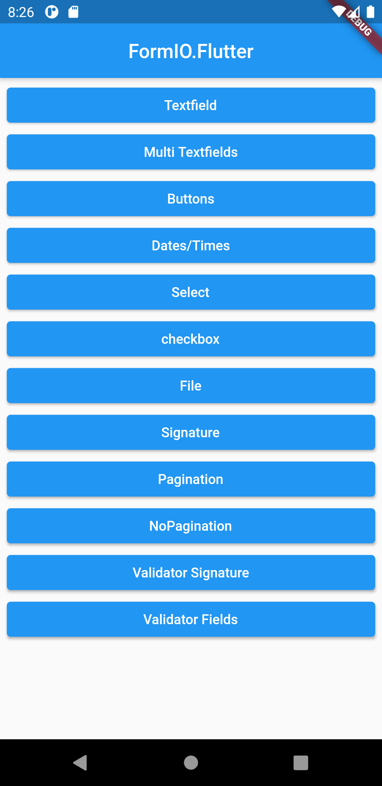

## Examples

### Multiple Textfields

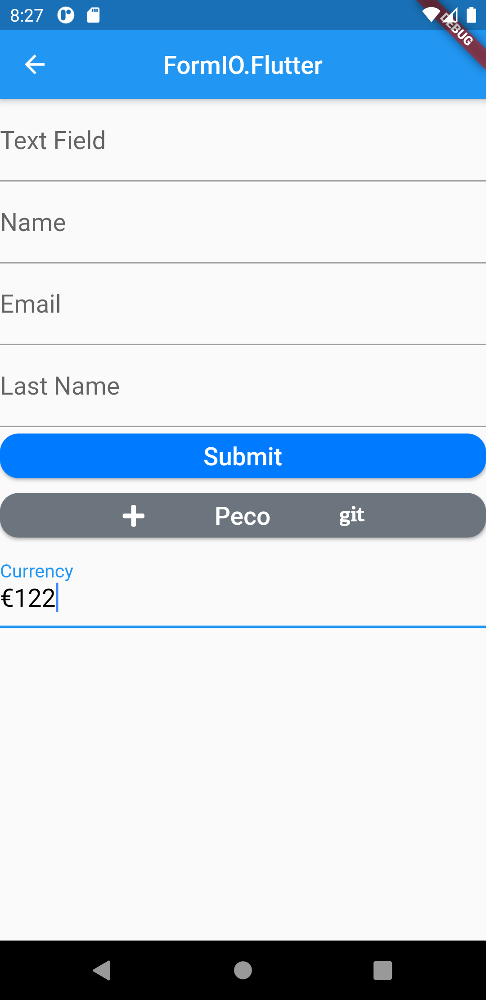


### File upload and dynamic conditionals

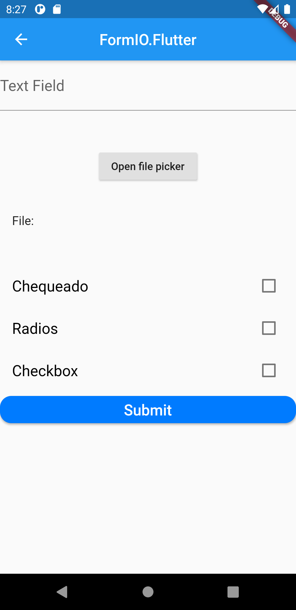
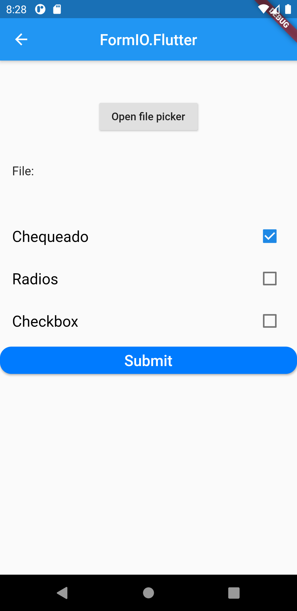
### Pagination (Wizard)

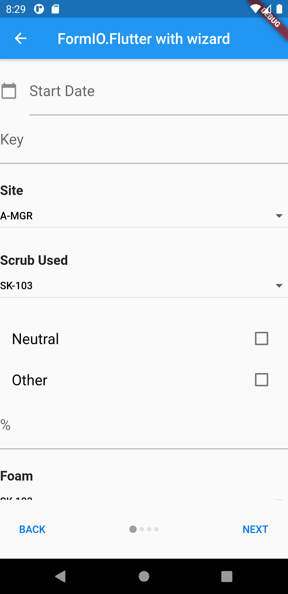
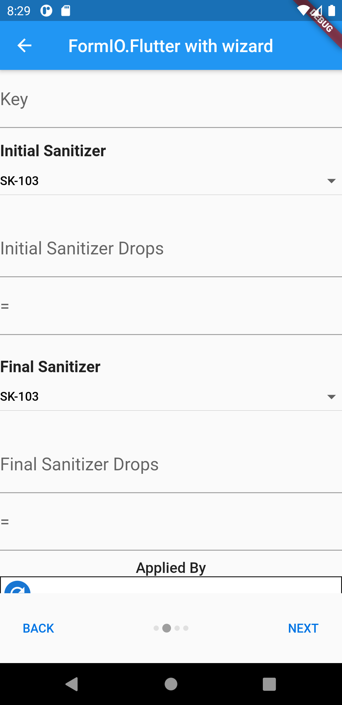
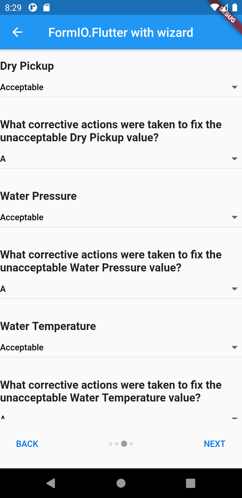
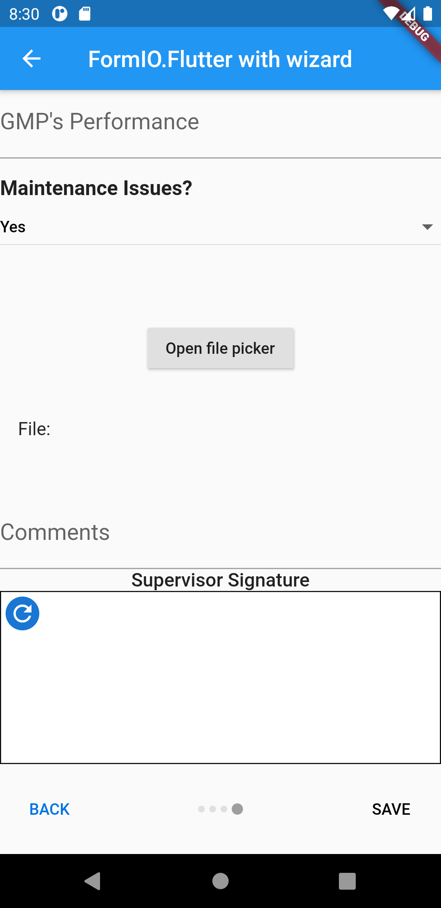

### Non-Pagination

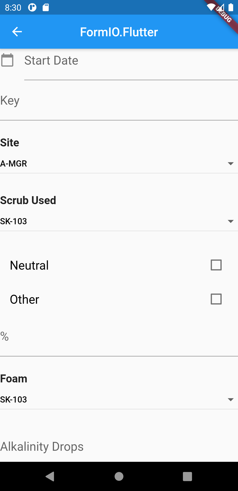

### Signatures


### Buttons


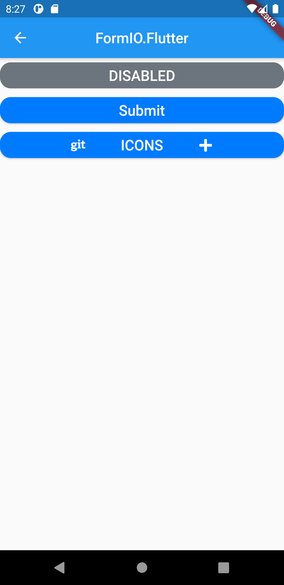

### Validations of all type of widgets

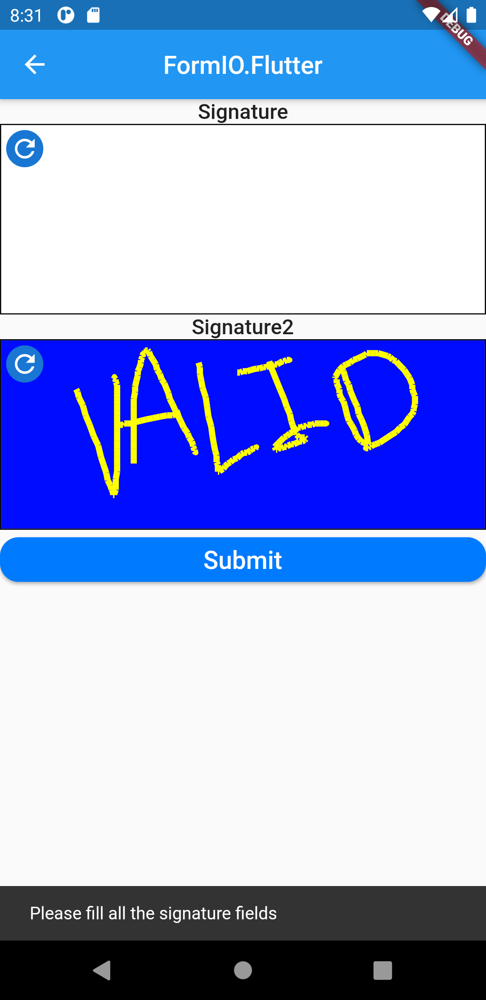
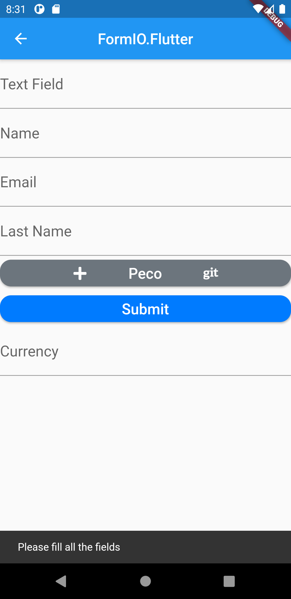

### Get Data from Form

To obtain the data from all the hierarchy widget, just do this:
```dart
/// This will return a [Map<String, dynamic>] with the respective value of the widget 
/// nested by their key.
parseWidgets(WidgetParserBuilder.widgets) => Map<String, dynamic>
```

DONE:
- [x] Customization of basic widgets: buttons, texts.
- [x] Customization of click events at any hierarchy level.
- [x] Customization of signature widget and file widget.
- [x] Validator of empty signatures.
- [x] Validator of empty fields.
- [x] Stream of calculated fields on real-time.
- [x] Stream of conditional fields on real-time.
- [x] Parse of font-awesome icons, material icons, and basic icons.
- [x] Hierarchy constructor of widget.
- [x] Pagination of widgets when scheme has wizard on it.
- [x] Added documentation to all the classes used in **DART**.


### Contributing

All contributions are welcome!

If you like this project then please click on the :star2: it'll be appreciated or if you wanna add more epic stuff you can submit your pull request and it'll be gladly accepted :ok_man:

or if you have an idea please let me know to my email: <luisalfonsocb83@gmail.com>.
